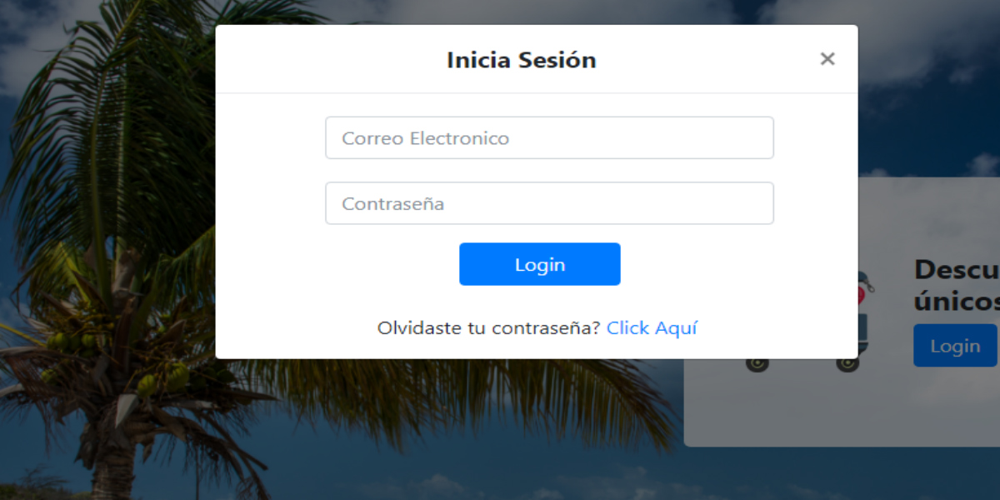
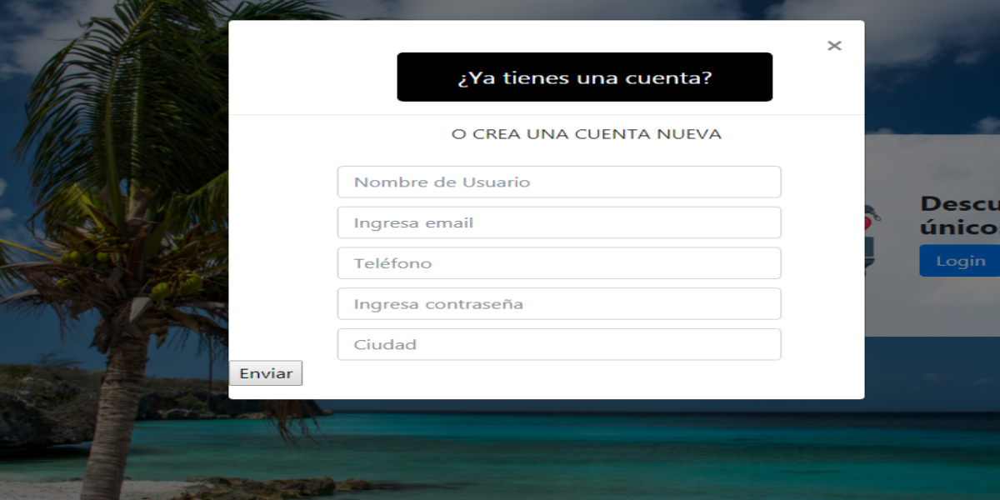
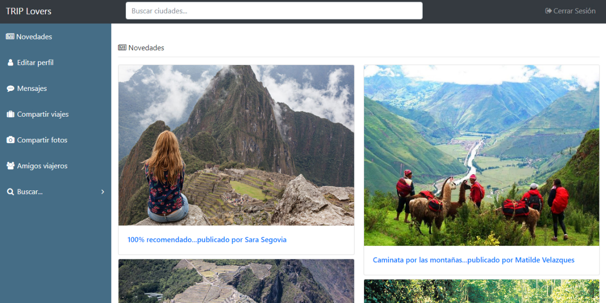
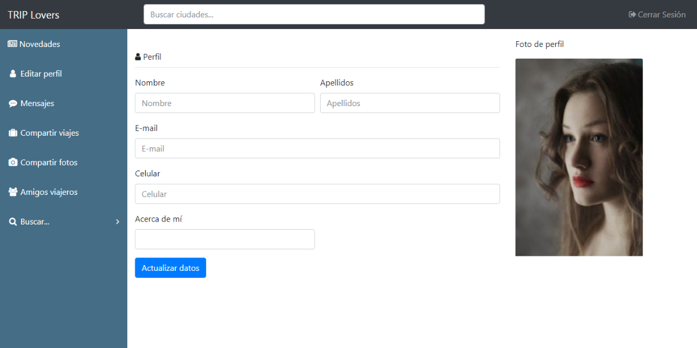
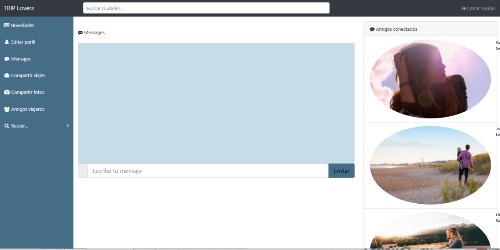
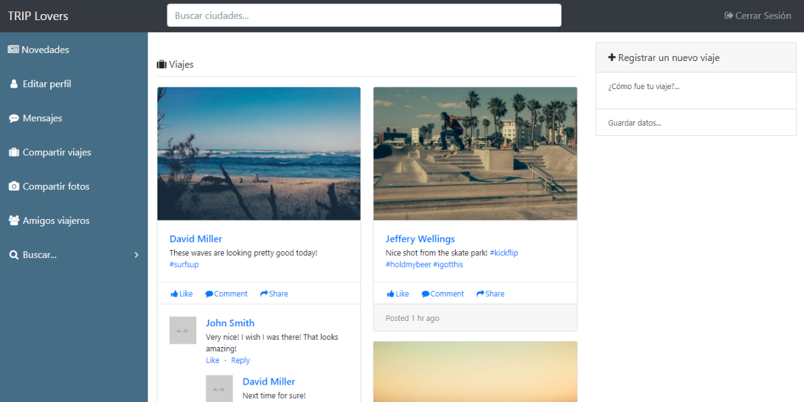
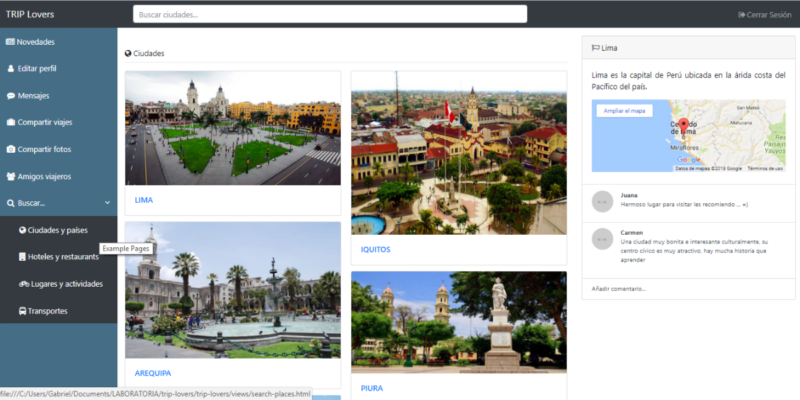

## Producto final: Red social trip-lovers
***

#### 1. Objetivo:
Desarrollar una red social para aquellos usuarios que quieren viajar.

#### 2. Descripción del proyecto:

Los motivos para viajar son incalculables y dependen de cada persona. En ocasiones se viaja para romper con la rutina, para tomar distancia de lo cotidiano, para conocer y experimentar nuevas culturas, para ver “ese” templo o monumento que tanto te ha hecho suspirar al admirarlo en fotos. También se viaja para conocer gente, para conocerse a una misma, para conocer los propios límites e incluso para desdibujarlos y trazarlos “un poquito más allá”. Se viaja por la adrenalina, por amor al viaje, por placer a lo desconocido y por miedo a lo desconocido. A veces se viaja simplemente porque sí y en resumen esa es la razón de ser de nuestra red social Trip Lovers.

A continuación te dejamos algunos datos de Trip Lovers que te serán utiles a la hora de navegar por nuestra red social:

* En Trip lovers nos gusta tener muchos amigos y es por eso que a la hora de ingresar nuestra web te pedira registrarte en caso no lo estes y para aquellos que ya lo hayan hecho les pedirá hacer un login.

* Los contenidos de Trip Lovers cuentan con mucha información de nuestro amado país ya que es una red social orientada a fomentar el turismo interno desde las experiencias de cada uno de sus habitantes o personas que les apasione conocer y viajar por el Perú. Si eres un peruano y te gusta viajar Trip lovers es la red social para ti. Si eres extranjero pero llevas un corazón peruano y quieres conocer nuestro país Trip lovers te brindará todos los datos necesarios para que termines animándote a venir, aquí podrás buscar muchos datos importantes como:

Datos Novedades

Datos perfil

Datos chat y mensajes

Datos compartir fotos y experiencias de viajes

* Adicional a la información que brindamos en Trip Lovers podrás compartir tus fotos, tus experiencias de viaje, chatear y conversar con tus amigos, revisar las novedades de tus amigos y red, actualizar tu perfil, entre otras cosas divertidas.

Datos de ciudades y países

* ¿Te gusto lo hemos hecho para tí? Que esperas animate y registrate en trip lovers

#### 3. Recursos utilizados
* HTML5
* CSS
* BOOTSTRAP v4.
* JQUERY v3.2.1.
* FIREBASE

#### 4. Integrantes
* Jymma Mogollon
* Lourdes Loayza.
* Melyna Bisley.

